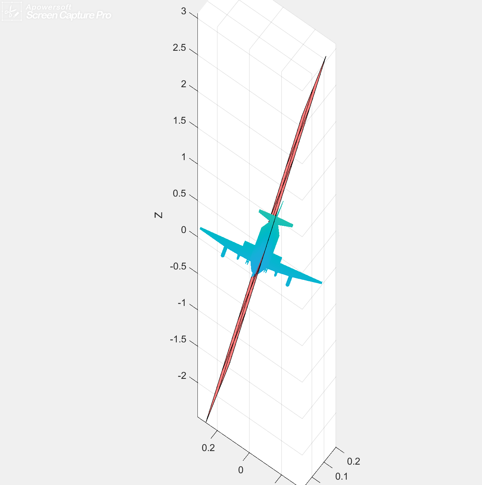

# 任务报告_PRS-Net
[github]:https://github.com/sbysbysbys/repoduction_PRSNet
__孙博一__       __中国科学院大学__      __计算机科学与技术__
## 日程
* 7.10：阅读论文，初步设计
* 7.11：详细设计，跑通源代码，开始入手代码
* 7.12：写代码，写报告
* 7.13：写代码，写报告
* 7.14：写完基本代码，跑输出，做可视化
* 7.15：调试，前些天的训练集跑模型，写报告

## 项目目录
- reproduction
  - checkpoints
    - model
      - 实验模型.pth
  - datasets
    - shapenet
      - train
        - 训练集.mat
      - test
        - 测试集.mat
  - results
    - compare
      - 实验结果.mat
  - visualization
    - generateSurfacePlot.m 结果可视化
    - visPointsPlaneAndRot.m
  - config.yaml
  - model.py
  - test.py
  - train.py
  - utils.py


## 论文总结与分布实现
本复现任务中的所有代码（除数据初处理，即原实验的\preprocess\precomputeShapeData.m）均为自主完成。

###     概述
*   PRS-Net是一种无监督的深度学习方法，用于检测三维物体的全局平面反射对称性。
*   思路是将对称性检测问题建模为可微函数，该函数可以通过CNN神经网络获得。
*   进一步设计了专用的对称距离损失和正则化损失，以避免生成重复的对称平面。

###     网络结构设置
*    编码器部分是五层的卷积加上最大池化层，输入为体素，维度是32*32*32
*    本文在后面进一步探讨了体素的维度（16，32，64，128）对于网络的影响。
*    结果表明：在32的时候整个网络的性能达到最大值，文中对于这一部分的解释是由于参数的过拟合。
*    实验中，值得注意的是在计算对称损失的时候，使用文中的方法，取出了对应体素中心的的closepoint作为计算对称损失的一个指标。
*    后面分别对6个子任务使用全连接层，最终压缩成一个4元张量，由于平面和转轴都是四元张量可表示的，最终再加上初始化参数，得到最终的结果。
*    在源代码中，初始化参数加在了模型下最后一层全连接层的偏移上，同时由于每次进入最后一层都会更新偏移，那么初始化参数就相当于是一个常量加上。那么这个初始化参数的作用是什么？去掉这个参数会有什么样的后果。
*    在我进行设计的时候，我一直都不知道初始化参数是加在那一处。因为在我的想法里，最后一层进行的输出就可以作为表示对称轴和对称平面的四元组，那么初始化的意义在哪里？
*    我的想法是：
*    1.确定张量元素的大小左右区间，在初始化的时候，我们现将其中的一维设成1，那么在后面学习的时候，就能有一个合适的参考。
*    2.增加模型的变动性，让模型更有效的学习。
*    首先是，在实际生活中，以及训练集中，那些模型如果有更多的对称轴或者对称平面，那么那些对称轴或者是对称平面多半是相互正交的，这样一来，对于同样产出64大小的参数，类似的矩阵变换就能得出较好的效果，也就是对于大多数模型来说，这样来初始化对于全连接层的参数是友好的。
*    举个例子：我们在一维的平面上去做预测，预测的范围就假设在[-2,2]，那么如果把3个参数参数都放在原点，那么参数学习的平均移动范围平均是在3左右，如果初始化在-1，0，1，那么模型会将这几个参数往最近的预测值去预测，就会小一点。大概能类比到这个问题。我猜的，不一定对。
    
*    代码方面，模型在models文件中

###     损失函数
*    损失函数的设置是有效的。分为对称性误差和正则化误差。
*    对称性误差：
*    1.平面的对称性误差：
*    平面的对称性误差比较好求，通过公式求就可以。
*    需要注意的是，这里我们进行求值的时候，是对于点集的运算，同时的，对于一个batch的张量进行的运算，张量的维度是一个难以估量的一件事。在utils中，我设置了对应的类表示对称面和对称轴。同样设置了对应的操作，以便于不仅能够在训练的时候使用并且存在梯度，同时能够调试并且在后面做结果的时候友善输出。
```
# 以平面为例
class SymmetryPlane:
    def __init__(self,data,plane):

    # 对称点
    def sympoint(self,p):
    
    # 对称点集
    def sympoints(self):

    # 最短距离 # 对称距离损失
    def Lsd(self):

```
*   在这个过程中使用到的各式各样的工具也放在utils中，包括，对称点解析，寻找体素，计算最短距离， 大部分的工具函数都可以在对称平面和对称轴中复用。其中比较特殊的，有关于四元组的计算和操作，有很多的库能够使用，但是或多或少存在问题，其中大都无法进行梯度下降，因为接受的形参要求大都是数组或是列表。
*    因此按照四元组虚部实部的计算方式，我重写了四元组的计算。
*    其余都比较好处理。

### 检查
*    一个比较需要关心的问题是这个东西是要放在哪里，我是放在了test的结果输出中。
*    但是，我们可以关注到，被筛选掉的参数参加了很大程度上的损失，不得不提到，这些被筛选掉的参数的损失至少占了全部损失的80%。
*   所以能不能把这个筛选变化形式，加入网络中去，或者能不能用一种方式，减少这些个被筛掉的参数对于损失的影响。
*   如果将他加入到网络中，由于可梯度下降的参数是逐渐学习的，那么一开始的筛选过程就比较难办，如何设置一个好的，随着epoch变化的变量来模拟每一此循环的筛选过程。也许可以通过在某一次循环之后加上这个筛选过程，这是可行的。或者让这个筛选的参数逐渐变小，也许也是可行的。或者，能否改变损失函数来进一步将学习的重心放在没被筛选掉的参数上。比如说在做平方损失的时候，对于一整个平面的值做开方或者取对数。取对数的话权重有应该如何设计，因为取对数可能会出现正负数的情况。
*    第一次跑出来结果之后，由于硬件原因，我无法做到把全部的模型跑一遍（shapenetcore.v2就100G，预处理之后感觉奔着300G去了，离谱，再加上我的苹果电脑没有独显，跑了两天才跑出来这么点预处理数据，这个后面再说）所以其实被筛选掉的内容占损失函数的比例不算太大，加上时间原因就没试（没独显用cpu跑的）。同样的如果去把loss开方的话影响应该不会大。
*    代码在utils中,其实应该叫second_check或者volidation。但是当时觉得这样比较顺口。同时确实进行了两次的检测，第一次是进行相近平面与对称轴的检测，第二次是进行对称损失函数过大的检测。
```
def double_check(data,param_p1,param_p2,param_p3,param_q1,param_q2,param_q3)
```

###  运行与结果
*   我使用我的macbook进行与处理数据，这个过程是漫长的，我一晚上进行预处理的的数据才达到500条，这样下去我可能大半年才能完成数据的预处理过程。同时，数据占用的内存也是巨大的，训练集本身就有100G，如果所有的数据进行预处理之后所达到的数据规模约为300G左右。这是我的电脑达不到的。
*   由于硬件限制，我无法完全训练整个模型，这里我挑选了两组模型进行训练：
*   第一组数据，shapenet第一个文件的一部分数据，其中数据量628个，旋转得到的数据1256个，测试集92个。
*   第二组数据，shapenet第2，3，4个文件的部分内容，其中数据量约为600个，旋转得到的数据10106个，测试数据91个

*   在两组实验中，均将epoch设为50+50
*   出乎意料的，实验结果较为精准，进一步验证了整个模型的正确性。

*   下面是第一组数据的结果展示：



*   下面是第二组数据的结果展示


*    值得注意的是，虽然部分结果依旧存在问题，但是大部分的结果都是较为正确的。使用较少的数据训练出相对较好的结果是令人意想不到的。
*    代码还有值得改进的地方。我的代码还存在着下面的问题：
*    由于电脑没有独显，我整个实验只使用到了cpu。由于时间原因，并没有添加gpu的使用
*    同样由于时间原因以及模型的区别，部分参数需要进行改动，现在使用的还是原来的参数，导致出现了部分可以避免的错误。

### 7.16 更新
*  发现一个的问题
*  相当于是旋转轴喜欢往0度或者是360度旋转，这里也许可以尝试在loss中添加一项La代表旋转损失La = w_a*w^2/(x^2+y^2+z^2),权重先设成3*3 = 9，不知道能不能行。

    


